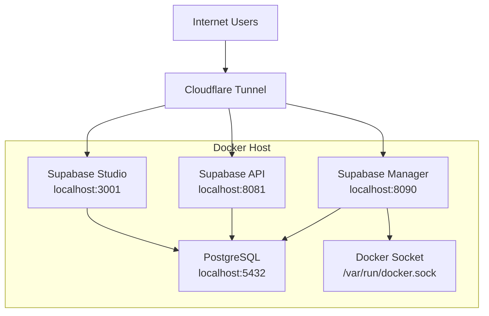

# Supabase Multi-Instance Manager

This project provides a multi-instance Supabase setup with a custom manager interface and Cloudflare Tunnel integration for custom domain access.

## System Architecture Overview



The Supabase Multi-Instance Manager consists of several interconnected components:

1. **Supabase Manager** - A Go-based web application that provides a dashboard for managing multiple Supabase projects
2. **PostgreSQL Database** - The underlying database that stores all project data in separate schemas
3. **Full Supabase Stack** - Complete Supabase installation with all services (Auth, REST, Realtime, Storage, etc.)
4. **Cloudflare Tunnel** - Provides secure public access to all services through custom domains

For a detailed technical breakdown of each component, see [docs/SUPABASE_MANAGER_ARCHITECTURE.md](docs/SUPABASE_MANAGER_ARCHITECTURE.md).

## Prerequisites

- Docker and Docker Compose
- Go (for building the manager)
- Cloudflare account with Tunnel configured
- Custom domains pointing to your Cloudflare Tunnel

## Setup

1. Clone this repository
2. Copy `env.example` to `.env` and configure your environment variables:
   ```bash
   cp env.example .env
   ```
3. Update the values in `.env` to match your custom domains and configuration
4. Update `config.yaml` with your database settings and authentication credentials
5. Configure Cloudflare Tunnel credentials in `/root/.cloudflared/`

## Environment Variables

The application uses the following environment variables:

- `DATABASE_URL` - PostgreSQL connection URL
- `PORT` - Port for the Supabase Manager application (default: 8090)
- `SUPABASE_API_ENDPOINT` - Your custom domain for the Supabase API
- `SUPABASE_STUDIO_DOMAIN` - Your custom domain for Supabase Studio

All configuration values must be provided through environment variables. The application will not use hardcoded defaults.

## Authentication

The Supabase Manager now includes basic authentication to secure access to the dashboard and API endpoints. The default credentials are:

- **Username**: `admin`
- **Password**: `supabase123`

You can change these credentials by modifying the `auth` section in the `config.yaml` file:

```yaml
auth:
  username: "your-username"
  password: "your-password"
```

For production use, it's highly recommended to change these default credentials to something more secure.

## Scripts

- `./start-all.sh` - Starts all services (manager and full Supabase stack) with Cloudflare Tunnel
- `./stop-all.sh` - Stops all services and Cloudflare Tunnel
- `./restart-all.sh` - Restarts all services
- `./start-supabase.sh` - Starts only the full Supabase stack
- `./test-services.sh` - Tests accessibility of all services
- `./check-tunnel.sh` - Checks Cloudflare tunnel status and configuration

For detailed documentation of these scripts, see [SCRIPTS.md](SCRIPTS.md).

## Services

- Supabase Manager: http://localhost:8090
- Database: localhost:5432
- API Gateway: http://localhost:8081
- Studio: http://localhost:3001

## Custom Domains

- Manager: https://supabase-okiabrian.my.id
- API: https://api-supabase-okiabrian.my.id
- Studio: https://studio-supabase-okiabrian.my.id

## API Usage

For detailed information on how to use the Supabase API, see [API_USAGE.md](API_USAGE.md).

## Development

To build the manager:

```bash
go build -o supabase-manager .
```

To run tests:

```bash
go test -v
```

## Recent Fixes

### Temporary Schema Filtering Fix

A recent fix was implemented to properly filter out temporary PostgreSQL schemas (those starting with `pg_temp_` and `pg_toast_temp_`) from the project listing. For detailed information about this fix, see [docs/FIX_TEMP_SCHEMA_FILTERING.md](docs/FIX_TEMP_SCHEMA_FILTERING.md).

## Documentation

Additional documentation can be found in the following files:

### System Architecture and Technical Details
- [docs/SUPABASE_MANAGER_ARCHITECTURE.md](docs/SUPABASE_MANAGER_ARCHITECTURE.md) - Comprehensive documentation of the system architecture, components, and technical implementation

### API and Usage Documentation
- [API_USAGE.md](API_USAGE.md) - Detailed API usage instructions
- [API_AUTH.md](API_AUTH.md) - Authentication information for the API

### Configuration and Setup Guides
- [CLOUDFLARE_SETUP.md](CLOUDFLARE_SETUP.md) - Cloudflare Tunnel setup instructions
- [DNS_SETUP.md](DNS_SETUP.md) - DNS configuration instructions
- [SCRIPTS.md](SCRIPTS.md) - Detailed script documentation

### Development and Maintenance
- [docs/DEVELOPMENT_GUIDE.md](docs/DEVELOPMENT_GUIDE.md) - Development guide with important information for contributors
- [docs/FIX_TEMP_SCHEMA_FILTERING.md](docs/FIX_TEMP_SCHEMA_FILTERING.md) - Detailed documentation of the temporary schema filtering fix
- [docs/FIX_SUMMARY.md](docs/FIX_SUMMARY.md) - English summary of all fixes

### Summary Documents
- [FIX_SUMMARY.md](FIX_SUMMARY.md) - Indonesian summary of all fixes
- [fix.md](fix.md) - Detailed fix documentation# supabase-manager
