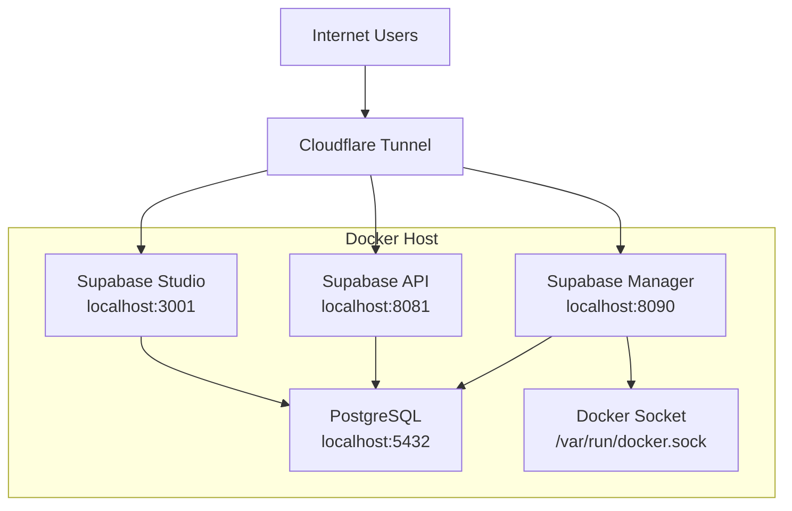

# Supabase Multi-Instance Manager - System Architecture

## Overview

The Supabase Multi-Instance Manager is a Go-based application that provides a web interface for managing multiple Supabase instances. It allows users to create, manage, and access multiple isolated database schemas within a single PostgreSQL database, with each schema representing a separate "project".

## System Components

### 1. Supabase Manager Application (Go)

The core of the system is a Go application built with the Gin web framework that provides:

- Web-based dashboard for managing projects
- REST API for programmatic access
- Database schema management
- Docker integration for service management

### 2. PostgreSQL Database

The underlying database that stores all project data in separate schemas.

### 3. Full Supabase Stack

A complete Supabase installation including:
- Kong API Gateway
- PostgREST for REST API access
- GoTrue for authentication
- Realtime for real-time subscriptions
- Storage API for file storage
- Supabase Studio for administration

### 4. Cloudflare Tunnel

Provides secure public access to the services through custom domains.

## Architecture Diagram



## Core Application Structure

### Main Components

1. **Web Server** - Gin-based HTTP server
2. **Database Manager** - PostgreSQL connection and operations
3. **Project Management** - Schema creation/deletion
4. **Docker Integration** - Service status and control
5. **Template Engine** - HTML dashboard rendering

### File Structure

```
supabase_multi-instance/
├── main.go                 # Main application entry point
├── config.yaml             # Application configuration
├── Dockerfile              # Container build definition
├── docker-compose.yml      # Manager services definition
├── supabase-full-stack.yml # Full Supabase stack definition
├── templates/              # HTML templates
│   ├── dashboard.html      # Main dashboard
│   ├── api-help.html       # API documentation
│   └── error.html          # Error pages
├── static/                 # Static assets (CSS, JS)
│   └── style.css
├── docs/                   # Documentation
├── scripts/                # Management scripts
└── volumes/                # Configuration volumes
    ├── api/
    │   └── kong.yml        # Kong API Gateway config
    └── db/
        └── init/           # Database initialization scripts
```

## Main Application (main.go)

### Key Features

1. **Configuration Management**
   - Loads settings from `config.yaml`
   - Supports environment variable overrides
   - Default values for all settings

2. **Database Operations**
   - PostgreSQL connection management
   - Schema creation and deletion
   - Project listing with filtering
   - Table enumeration within schemas

3. **Web Interface**
   - Dashboard with project overview
   - Project creation/deletion UI
   - API documentation access
   - Docker service status monitoring

4. **API Endpoints**
   - `GET /` - Dashboard
   - `GET /projects` - List all projects
   - `POST /projects` - Create new project
   - `DELETE /projects/:name` - Delete project
   - `GET /projects/:name/tables` - List tables in project
   - `POST /projects/:name/query` - Execute query in project context
   - `GET /docker/status` - Docker service status
   - `POST /docker/restart` - Restart Docker services
   - `GET /api-help/:project` - Project-specific API documentation

### Project Schema Structure

Each project creates a PostgreSQL schema with:

1. **Users Table**
   ```sql
   CREATE TABLE users (
       id UUID PRIMARY KEY DEFAULT gen_random_uuid(),
       email VARCHAR(255) UNIQUE NOT NULL,
       name VARCHAR(255),
       avatar_url VARCHAR(255),
       created_at TIMESTAMP WITH TIME ZONE DEFAULT NOW(),
       updated_at TIMESTAMP WITH TIME ZONE DEFAULT NOW()
   );
   ```

2. **Posts Table**
   ```sql
   CREATE TABLE posts (
       id UUID PRIMARY KEY DEFAULT gen_random_uuid(),
       title VARCHAR(255) NOT NULL,
       content TEXT,
       slug VARCHAR(255) UNIQUE,
       published BOOLEAN DEFAULT false,
       user_id UUID REFERENCES users(id),
       created_at TIMESTAMP WITH TIME ZONE DEFAULT NOW(),
       updated_at TIMESTAMP WITH TIME ZONE DEFAULT NOW()
   );
   ```

3. **Row Level Security (RLS)**
   - Enabled on both tables
   - Permissive policies for all operations

4. **Public Views**
   - `public.{project}_users` view
   - `public.{project}_posts` view

### Schema Filtering

The application implements robust schema filtering to show only user-created projects:

```sql
SELECT schema_name, CURRENT_TIMESTAMP as created_at
FROM information_schema.schemata 
WHERE schema_name NOT IN (
    'information_schema', 
    'pg_catalog', 
    'public'
)
-- Exclude all PostgreSQL system schemas
AND schema_name !~ '^pg_'
-- Exclude Supabase system schemas  
AND schema_name NOT IN (
    'auth', 
    'storage', 
    'supabase_functions', 
    'extensions', 
    'realtime', 
    'vault', 
    'graphql', 
    'graphql_public'
)
-- Exclude TimescaleDB schemas if present
AND schema_name !~ '^_timescaledb_'
```

## Docker Configuration

### Multi-Stage Build (Dockerfile)

```dockerfile
# Build stage
FROM golang:1.21-alpine AS builder
WORKDIR /app
# Install dependencies and build Go binary

# Runtime stage
FROM alpine:latest
# Install docker, docker-compose, postgresql-client
# Copy binary and templates
```

### Manager Services (docker-compose.yml)

```yaml
version: '3.8'
services:
  supabase-manager:
    build: .
    ports:
      - "8090:8090"
    environment:
      - DATABASE_URL=postgres://postgres:postgres@db:5432/postgres?sslmode=disable
    depends_on:
      - db
    volumes:
      - /var/run/docker.sock:/var/run/docker.sock

  db:
    image: postgres:15
    environment:
      - POSTGRES_USER=postgres
      - POSTGRES_PASSWORD=postgres
      - POSTGRES_DB=postgres
```

### Full Supabase Stack (supabase-full-stack.yml)

Contains all Supabase services:
- Database (PostgreSQL)
- Kong API Gateway
- PostgREST
- GoTrue (Auth)
- Realtime
- Storage API
- Studio
- Postgres Meta

## Cloudflare Tunnel Configuration

### Configuration File (cloudflared-custom.yml)

```yaml
tunnel: a8b5c87a-f853-4a0d-b4a2-6c26620079ec
credentials-file: /root/.cloudflared/a8b5c87a-f853-4a0d-b4a2-6c26620079ec.json

ingress:
  # Route for your custom domain pointing to Supabase Manager
  - hostname: supabase.okiabrian.my.id
    service: http://localhost:8090
  # Route for Supabase API
  - hostname: api.supabase.okiabrian.my.id
    service: http://localhost:8081
  # Route for Supabase Studio
  - hostname: studio.supabase.okiabrian.my.id
    service: http://localhost:3001
  # Fallback route
  - service: http_status:404
```

### Custom Domains

1. **Manager**: https://supabase.okiabrian.my.id
2. **API**: https://api.supabase.okiabrian.my.id
3. **Studio**: https://studio.supabase.okiabrian.my.id

## Web Interface

### Dashboard (templates/dashboard.html)

Built with:
- Tailwind CSS for styling
- Alpine.js for interactivity
- Font Awesome for icons

Features:
- Project listing with table counts
- Docker service status
- Project creation modal
- API endpoint information
- Responsive design

### API Help (templates/api-help.html)

Provides:
- API key information (Anonymous and Service Role)
- Usage examples with curl commands
- Browser access limitations explanation

## Management Scripts

### Start All Services (start-all.sh)

1. Starts Supabase Manager and database
2. Starts full Supabase stack
3. Starts Cloudflare Tunnel

### Start Supabase Stack (start-supabase.sh)

Starts only the full Supabase services.

### Other Scripts

- `stop-all.sh` - Stops all services
- `restart-all.sh` - Restarts all services
- `test-services.sh` - Tests service accessibility
- `check-tunnel.sh` - Checks Cloudflare tunnel status

## Security Considerations

### API Keys

Two types of API keys are used:
1. **Anonymous Key** - For public/unauthenticated access
2. **Service Role Key** - For admin/privileged access

### Database Access

- Direct database access through Docker socket
- RLS enabled on all project tables
- Schema isolation for multi-tenancy

### Network Security

- Services bound to localhost
- Cloudflare Tunnel for public access
- No direct public exposure of services

## Deployment

### Prerequisites

- Docker and Docker Compose
- Go 1.21 (for development)
- Cloudflare account with Tunnel configured

### Setup Process

1. Clone repository
2. Configure `config.yaml`
3. Set up Cloudflare Tunnel credentials
4. Run `./start-all.sh`

### Configuration Files

- `config.yaml` - Application settings
- `cloudflared-custom.yml` - Cloudflare Tunnel configuration
- Environment variables for service configuration

## API Usage

### Project Management

```bash
# List projects
curl http://localhost:8090/projects

# Create project
curl -X POST http://localhost:8090/projects \
  -H "Content-Type: application/json" \
  -d '{"name": "myproject"}'

# Delete project
curl -X DELETE http://localhost:8090/projects/myproject
```

### Data Access

Each project's data is accessible through the Supabase API:

```bash
# Access users table
curl -H "apikey: YOUR_ANON_KEY" \
  https://api.supabase.okiabrian.my.id/rest/v1/myproject_users?select=*

# Access posts table
curl -H "apikey: YOUR_ANON_KEY" \
  https://api.supabase.okiabrian.my.id/rest/v1/myproject_posts?select=*
```

## Troubleshooting

### Common Issues

1. **Services not starting**: Check Docker logs
2. **Cloudflare Tunnel issues**: Verify credentials and configuration
3. **Database connection errors**: Check connection settings
4. **API access denied**: Ensure proper API keys are used

### Useful Commands

```bash
# View running containers
docker ps

# View container logs
docker-compose logs supabase-manager

# Check port usage
lsof -i :8090

# Test service accessibility
curl http://localhost:8090/projects
```

## Future Enhancements

1. User authentication for the manager
2. Enhanced project configuration options
3. Backup and restore functionality
4. Monitoring and alerting
5. Improved error handling and logging